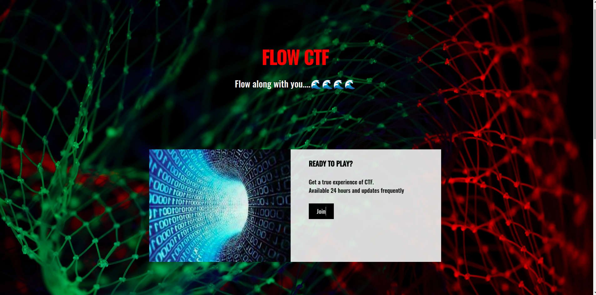
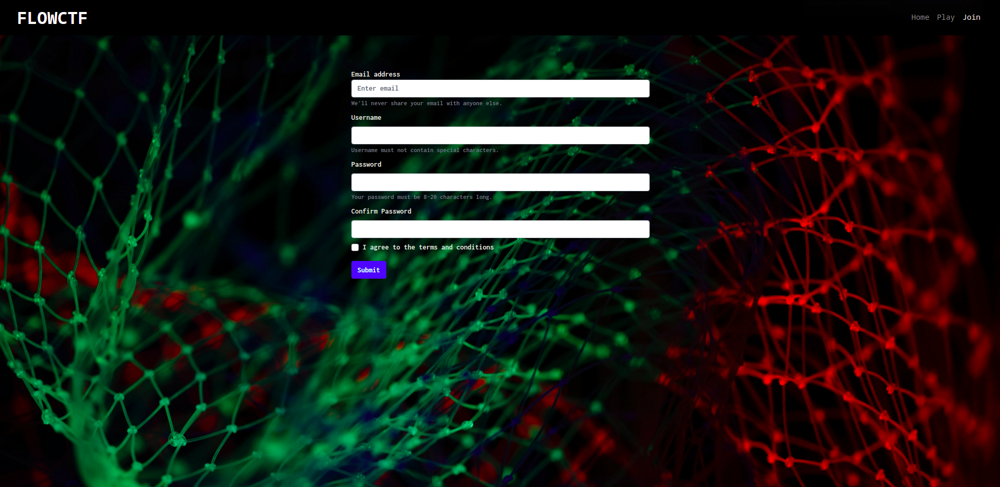
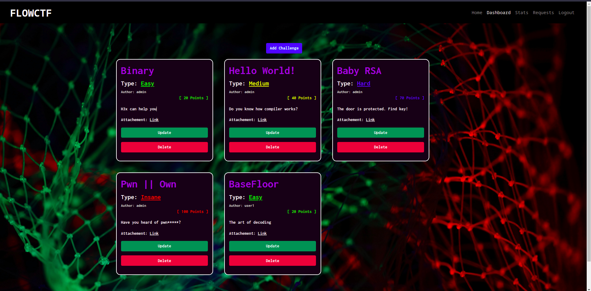
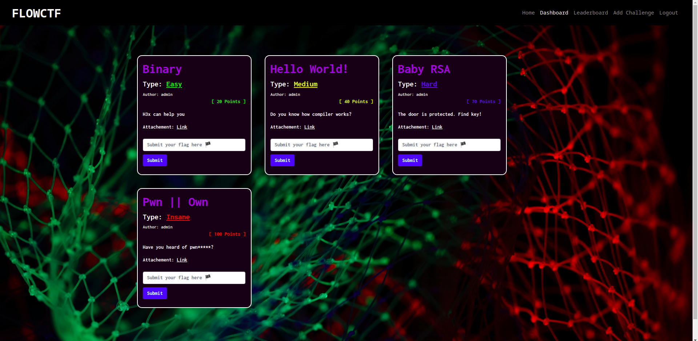
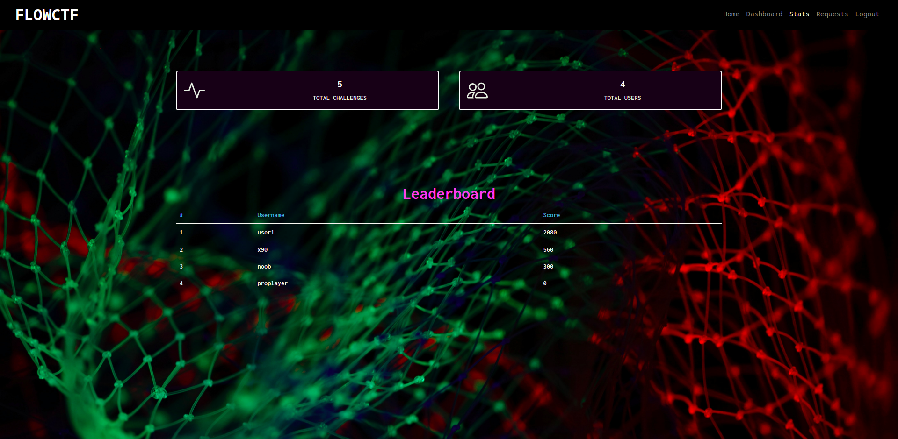
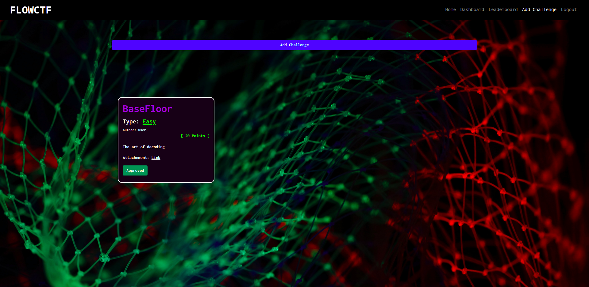

# FLOWCTF

A FLOWCTF is a place for tech enthusiast who want to improve their skill as well as it also for beginners who are 
interested in technologies.

Different category of challenges ranging from **easy-to-insane** are availabe at FLOWCTF
to hone your skills. 

FLOWCTF is created mostly using **Bootstrap**. It uses php for validation and is responsive as well.
Most of part uses PHP and for the UI it has its own custom CSS as well Bootstrap.

**Get a Flag!**
**Get Points**

**Get ready to be on the top of leaderboard**

## Features
- Admin has acess to every elements.
- User can add challenges **(Needs Approval From admin)**.
- Responsive Pages
- Check Flags and gets point as reward
- Leaderboards
- Stats
- Animates on Scroll


## Usage/Examples

```bash
git clone https://github.com/prashantstha17/FlowCTF
```
Move this repo to htdocs
and start xampp

And enter this link to your browser
```web
http://localhost/FlowCTF/page/index.php
```

## Screenshots
#### Home

#### Register

#### Admin Dashboard

#### User Dashboard

#### Stats

#### User adding challenge


## Lessons Learned

I came up with different ideas and furthermore this project has helped me a lot in my problem
solving skills. Thanks to this assignment I was able to know different things related to web and how it works.


